# Testing

## Test Plan

### Test case 1

Description: A user can view the list of auctioned products without having to log in

Preconditions: The user is not logged in

| Step | Action                       | Expected results                        |
| ---- |------------------------------|-----------------------------------------|
| 1    | Open the website             | The list of auctioned products is shown |

### Test case 2

Description: A user can view the details of an auctioned product without having to log in, such as:
- the name of the product
- the price in kebabs
- who placed bids
- winning bid
- when the auction ends

| Step | Action                 | Expected results                    |
| ---- |------------------------|-------------------------------------|
| 1    | Open the website       | The list of auctioned cars is shown |
| 2    | Click on a desired car | The details of the car are shown    |

### Test case 3

Description: The user can search the list of auctioned products by name

| Step | Action                                            | Expected results                                      |
| ---- |---------------------------------------------------|-------------------------------------------------------|
| 1    | Open the website                                  | The list of auctioned cars is shown                   |
| 2    | Click on the search bar in the top of the auction | The cursor is placed in the search bar                |
| 3    | Type a car brand or make                          | The typed car brand or make appears in the search bar |

### Test case 4

Description: Bids cannot be removed or modified once they are made

| Step | Action                                            | Expected results                                       |
| ---- |---------------------------------------------------|--------------------------------------------------------|
| 1    | Open the website                                  | The list of auctioned cars is shown                    |
| 2    | Log in as an user                                 | The user is logged in, the list of cars is shown again |
| 3    | Click on a "See more" button of a desired product | The details of the car are shown                       |
| 4    | Place a bid on the car for the bidding test)      | The bid is placed                                      |

### Test case 5

Description: A user can log in

| Step | Action                                                                                                                                    | Expected results                                           |
| ---- |-------------------------------------------------------------------------------------------------------------------------------------------|------------------------------------------------------------|
| 1    | Open the website                                                                                                                          | The list of auctioned cars is shown                        |
| 2    | Click on a "Log in" button in the header of the website                                                                                   | The Log In modal is shown                                  |
| 3    | Fill in the credentials: **email**: _rimas@gmail.com_, **password**: password123 OR **email**: rokas@gmail.com, **password**: password123 | The credentials appear in the input fields                 |
| 4    | Click on the "Log In" button below the input fields                                                  | The user is logged in, the list of products is shown again |

### Test case 6

Description: A user can place a bid

| Step | Action                                                                        | Expected results                                       |
| ---- |-------------------------------------------------------------------------------|--------------------------------------------------------|
| 1    | Open the website                                                              | The list of auctioned cars is shown                    |
| 2    | Log in                                                                        | The user is logged in, the list of cars is shown again |
| 3    | Choose a car to bid                                                           | The cars of the product are shown                      |
| 4    | Click on the input field on top of the bid section                            | The cursor appears in the input field                  |
| 5    | Type the amount of the bid, the amount should be greater than the highest bid | The typed amount appears in the input field            |
| 6    | Click on the "Place bid" button                                               | The bid is placed, the list of bids is updated         |

### Test case 7

Description: A user cannot place a bid if they are not logged in

| Step | Action                                                                        | Expected results                    |
| ---- |-------------------------------------------------------------------------------|-------------------------------------|
| 1    | Open the website                                                              | The list of auctioned cars is shown |
| 2    | Choose a car to bid on                                                        | The details of the cars are shown   |
### Test case 8

Description: A user cannot place a bid if the amount is incorrect

| Step | Action                                                                         | Expected results                                       |
| ---- |--------------------------------------------------------------------------------|--------------------------------------------------------|
| 1    | Open the website                                                               | The list of auctioned cars is shown                    |
| 2    | Log in                                                                         | The user is logged in, the list of cars is shown again |
| 3    | Choose a car to bid on                                                         | The details of the car are shown                       |
| 4    | Click on the input field above the bid section                                 | The cursor appears in the input field                  |
| 5    | Type the amount of the bid, the amount should be **LESS** than the biggest bid | The typed amount appears in the input field            |
| 6    | Click on the "Place bid" button                                                | The bid is not placed, and an error message is shown   |

### Test case 8

Description: posting a new car

| Step | Action                          | Expected results                                                   |
| ---- |---------------------------------|--------------------------------------------------------------------|
| 1    | Open the website                | The list of auctioned cars is shown                                |
| 2    | Log in as an admin              | The user is logged in as an admin, the list of cars is shown again |
| 3    | press post new car button       | the new window opens on the screen                                 |
| 4    | Enter all the car details       | all the fields with the cars must be filled                        |
| 5    | Click POST button               | The car is posted                                                  |

### Test case 9

Description: user description is shown

| Step | Action                    | Expected results                                                  |
| ---- |---------------------------|-------------------------------------------------------------------|
| 1    | Open the website          | The list of auctioned cars is shown                               |
| 2    | Log in                    | The user is logged in, the list of cars is shown again |
| 3    | press user button         | all user details are shown                                        |

### Test case 10

Description admin can edit the car

| Step | Action                                       | Expected results                                               |
| ---- |----------------------------------------------|----------------------------------------------------------------|
| 1    | Open the website                             | The list of auctioned cars is shown                            |
| 2    | Log in as admin                              | The user is logged in as admin, the list of cars is shown again |
| 3    | press edit button on a car                   | edit information is shown                                      |
| 3    | change the desired information about the car | all the fields are filled up                                   |
| 3    | press update car button                      | car is edited                                                  |

### Test case 11

Description admin can delete the car

| Step | Action                                       | Expected results                                                |
| ---- |----------------------------------------------|-----------------------------------------------------------------|
| 1    | Open the website                             | The list of auctioned cars is shown                             |
| 2    | Log in as admin                              | The user is logged in as admin, the list of cars is shown again |
| 3    | press update car button                      | car is deleted                                                  |

## Test Report

**Carried out on:** 2024-10-20  
**Carried out by:** Rokas Pažėra 551495  
**Carried out using:** VScode, webstorm.

### Test Case 1 OK
Once the website is opened, the list of auctioned cars is shown.  
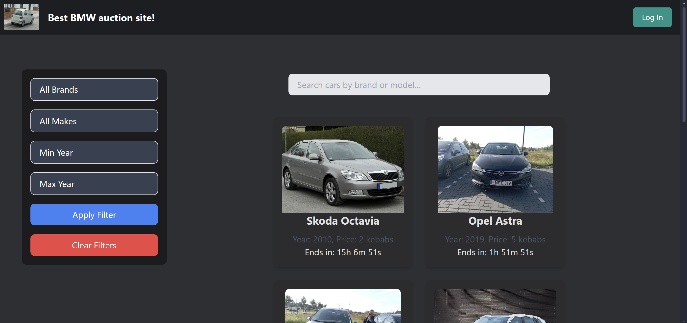

### Test Case 2 OK
Once the website is opened, the list of auctioned cars is shown.  

When a car photo is clicked, the details of this car are shown.  
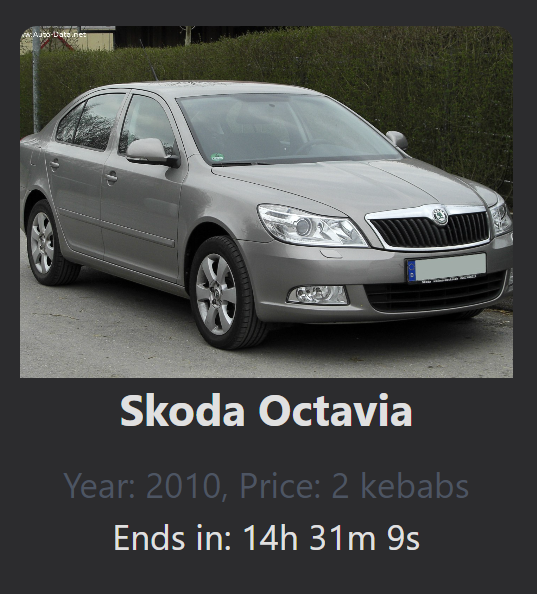

### Test Case 3 OK
Once the website is opened, the list of auctioned cars is shown.
The search bar is clicked, the cursor is placed in the search bar.  
The name of the car brand or make is typed in the search bar, the typed name appears in the search bar.
The specific car is shown on the screen.
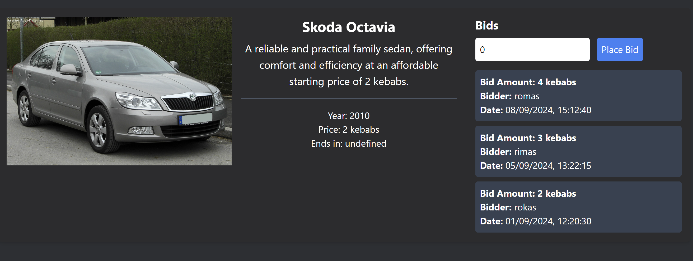

### Test Case 4 OK
Once the website is opened, the list of auctioned cars is shown.
The user is logged in
The Car photo is clicked and then the details of this product are shown.
The bid is placed
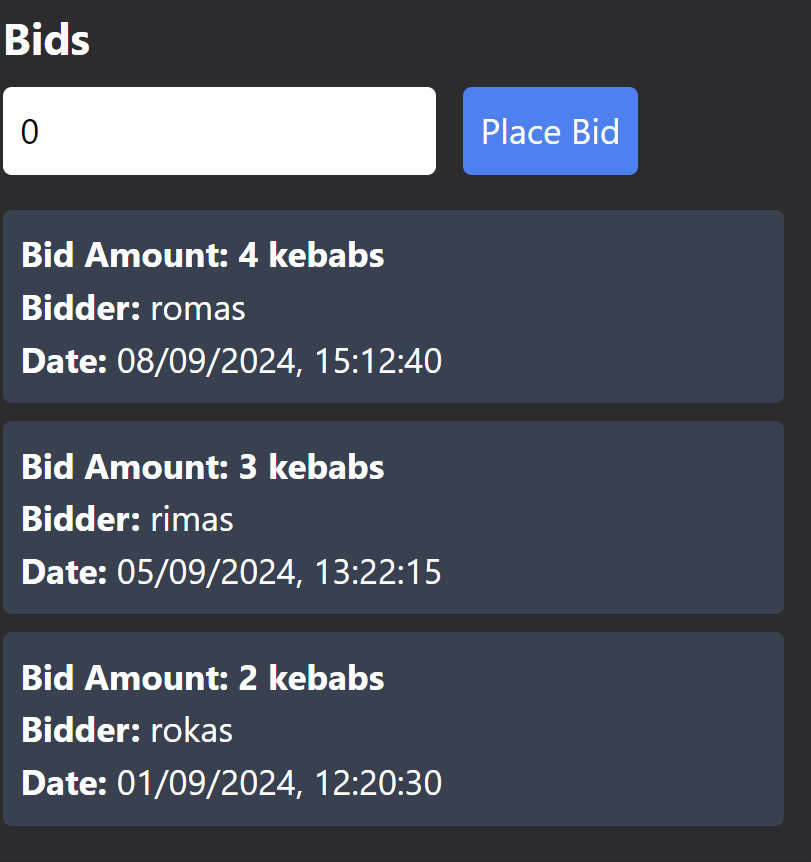  
There is no functionality for removing bids provided, so the bid cannot be removed.

### Test Case 5 OK
Once the website is opened, the list of auctioned cars is shown.
The "Log in" button in the header of the website is clicked, the Log In page is shown.  
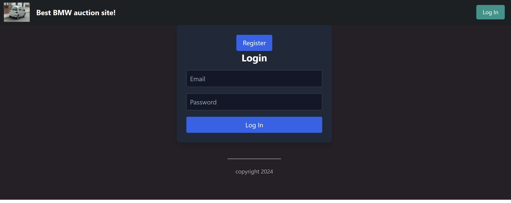  
The according credentials are filled in the input fields, the credentials appear in the input fields. (the credentials for the admin user in this case)  
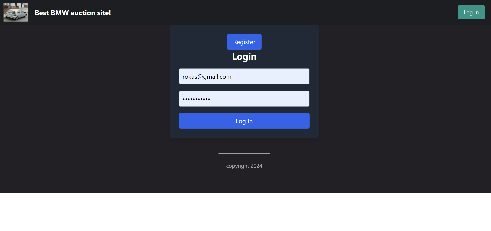  
The "Log In" button below the input fields is clicked, the user is logged in, the list of products is shown again. And the user(button for user details), Log Out button is displayed instead of the Log In button.  
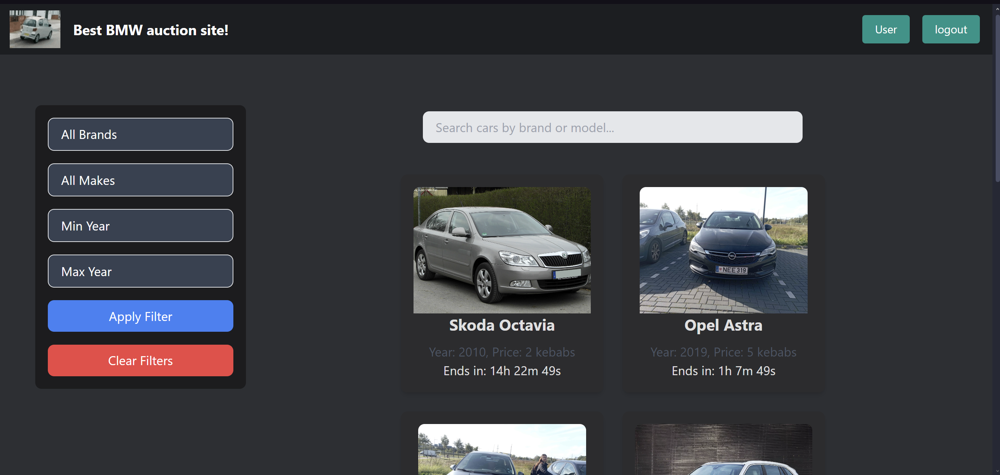

### Test Case 6 OK
Once the website is opened, the list of auctioned cars is shown. 
The user is logged in as a non-admin user
The Car photo is clicked and then the details of this product are shown.
The input above the bids list is clicked, the cursor appears in the input field.  
The amount of the bid is typed in the input field, the typed amount appears in the input field.  
The "Place bid" button is clicked, the bid is placed, the list of bids is updated.  
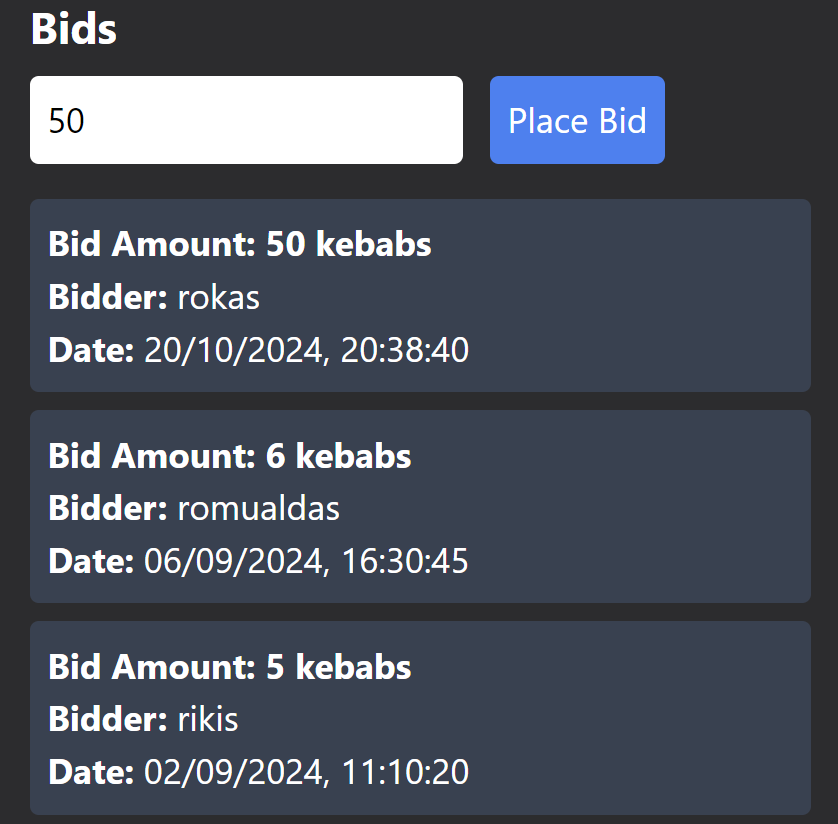

### Test Case 7 OK
Once the website is opened, the list of auctioned cars is shown.
The user is logged in as a non-admin user
The Car photo is clicked and then the details of this product are shown.
The input above the bids list is clicked, the cursor appears in the input field.  
The amount of the bid is typed in the input field, the typed amount appears in the input field.
The "Place bid" button is clicked, the bid is not placed, the error message is shown.  
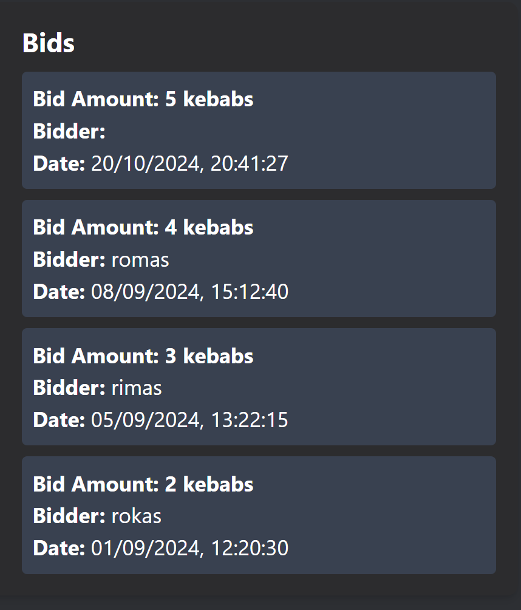

### Test Case 8 OK
Once the website is opened, the list of auctioned cars is shown.
The user is logged in as a non-admin user
The Car photo is clicked and then the details of this product are shown.
The input above the bids list is clicked, the cursor appears in the input field.  
The "Place bid" button is clicked, the bid is not placed, the error message is shown.  
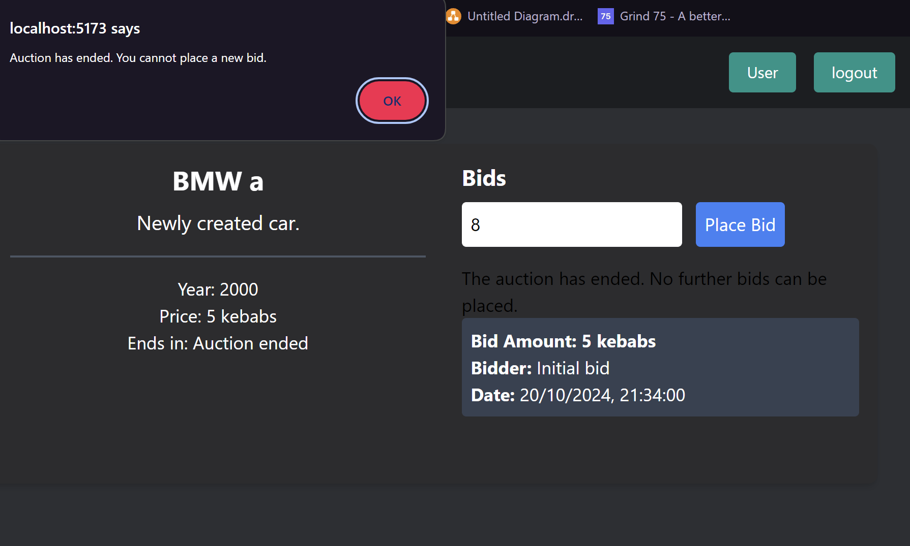

### Test Case 9 OK

Once the website is opened, the list of auctioned cars is shown.
The user is logged in
User button is clicked.
all the user information is shown.
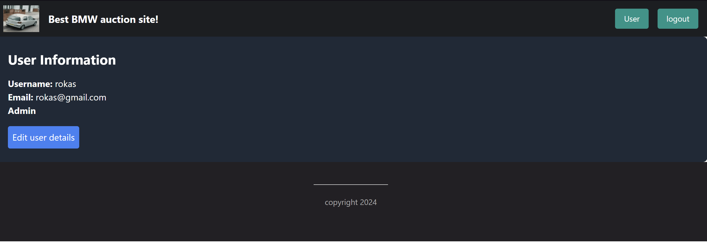

### Test Case 10 OK

Once the website is opened, the list of auctioned cars is shown.
The user is logged in as an admin.
A edit car button on the car is pressed
The details about the car are filled.
update car button is pressed.
the details of the car is updated.
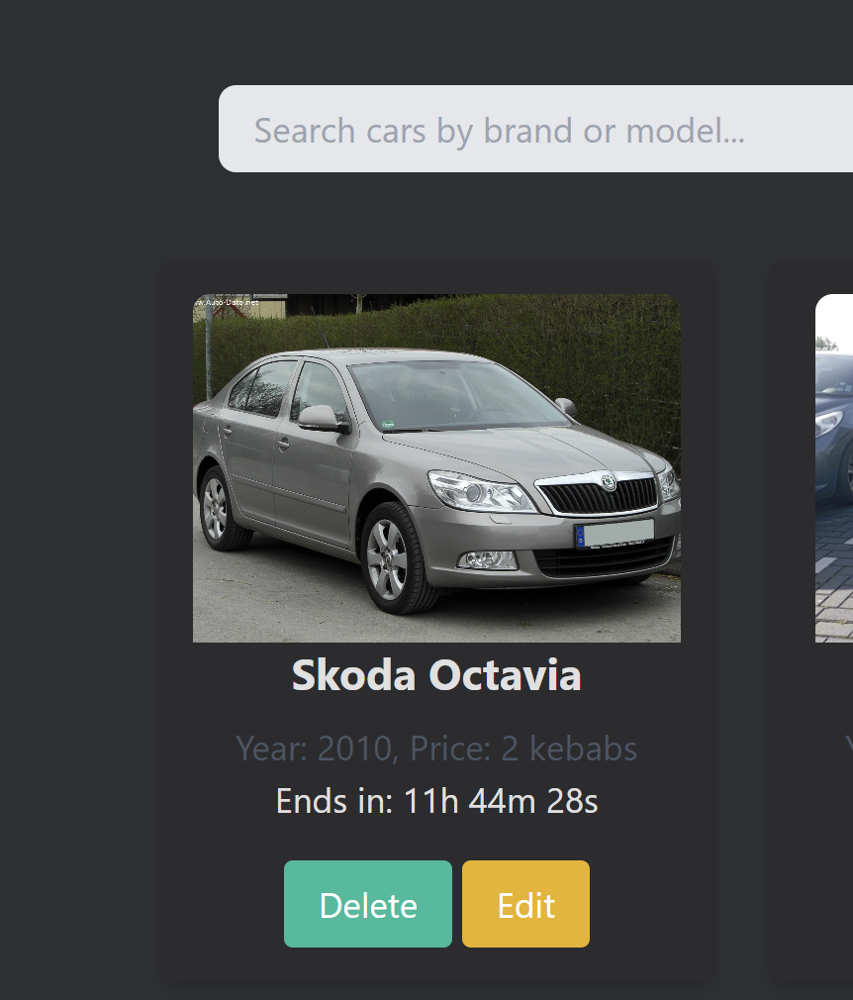
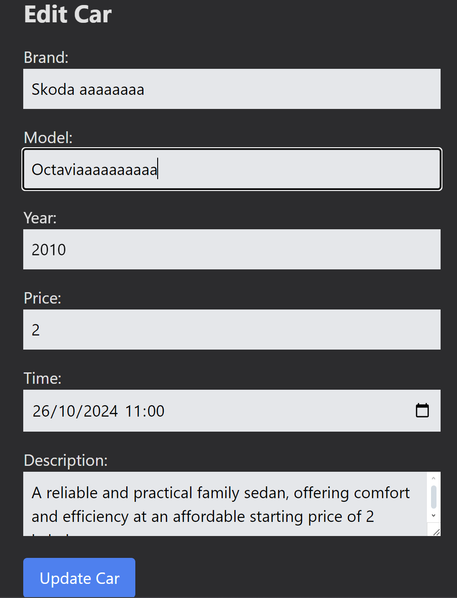
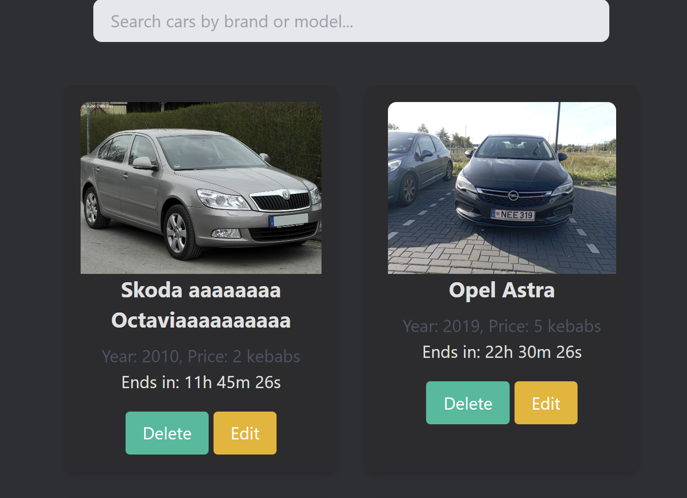

### Test Case 11 OK

Once the website is opened, the list of auctioned cars is shown.
The user is logged in as an admin.
A edit car button on the car is pressed
The details about the car are filled.
delete car button is pressed
The car is deleted.
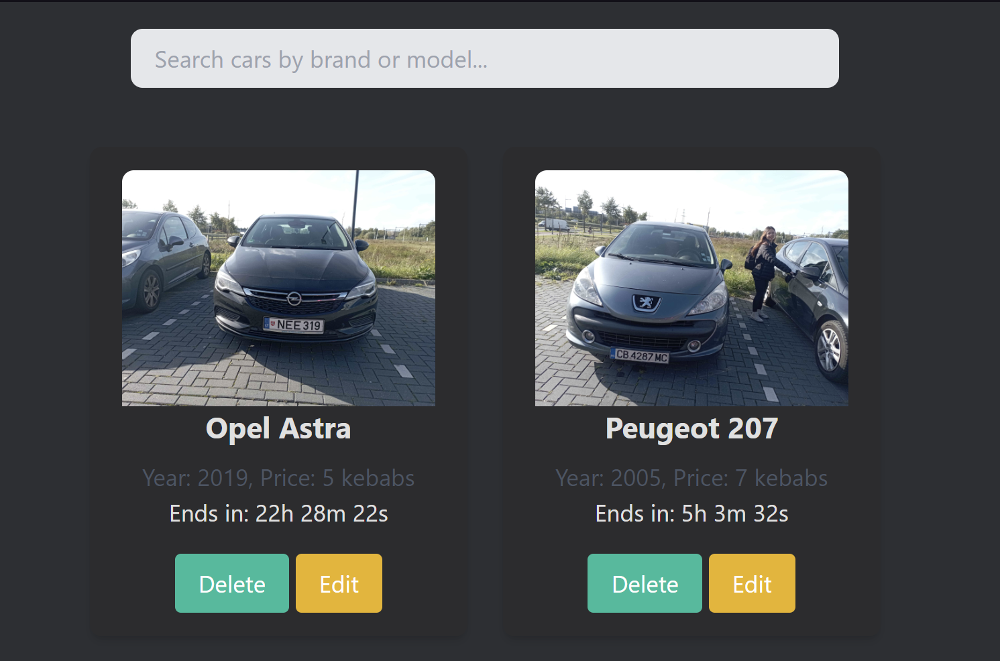

### Summary of Test Results

- **Total Test Cases:** 11
- **Passed:** 11
- **Failed:** 0

### Bug Reporting

No bugs were found during testing.

### Recommendations

- Making the bidding system parallel, so bidders, logged in different accounts can see live bid updates.

# Traceability Matrix

| Requirement ID | Requirement Description                                                | Test Case ID                 | Status |
|----------------|------------------------------------------------------------------------|------------------------------|--------|
| F1             | Display a list of auctionable products or services                     | TC-01, TC-02                 | Passed |
| F2             | Show product or service name, price, who placed bids, auction end time | TC-02                        | Passed |
| F3             | It must be possible to search the list of auctions by title or name    | TC-03                        | Passed |
| F4             | Bids cannot be removed or modified once they are made                  | TC-04                        | Passed |
| F5             | Input is validated client-side before sending to the server            | TC-06, TC-08                 | Passed |
| F6             | Input is validated server-side                                         | TC-06, TC-08                 | Passed |
| F7             | The list of auctions can be filtered on at least 3 attributes           | TC-03                        | Passed |
| F8             | A list of bids updates in real-time if another user places a bid       | N/A                          | N/A    |
| F9             | Only users with a bidder role can place bids                           | TC-06, TC-07                 | Passed |
| F10            | Only users with an admin role can manage auctions                      | TC-08, TC-10, TC-11          | Passed |

| Requirement ID | Requirement Description                                                | Test Case ID                 | Status |
|----------------|------------------------------------------------------------------------|------------------------------|--------|
| NF1            | The API returns valid JSON objects or arrays                           | Covered in TC-06, TC-08      | Passed |
| NF2            | The API returns appropriate/correct HTTP status codes                  | Covered in TC-06, TC-08      | Passed |
| NF3            | The API uses the correct HTTP verbs for its operations                 | Covered in TC-08, TC-10, TC-11 | Passed |
| NF4            | The API implements at least ReST level 3                               | Covered in backend design    | Passed |
| NF5            | The API uses query parameters for filtering                            | Covered in TC-03             | Passed |
| NF6            | The API uses query parameters for sorting                              | N/A                          | N/A    |
| NF7            | The API uses query parameters for limiting                             | N/A                          | N/A    |
| NF8            | Both the front-end and backend provide descriptive error messages      | Covered in TC-08             | Passed |
| NF9            | Both front-end and backend apply the separation of concerns principle  | General project design       | Passed |
| NF10           | API endpoints have meaningful good and bad weather tests               | Covered in TC-06, TC-08      | Passed |
| NF11           | The traceability matrix, test plan, and test report are documented     | Testing documentation        | Passed |
| NF12           | After registration, the user should be logged in                       | TC-05                        | Passed |
| NF13           | The front-end is built using Svelte (not SvelteKit)                    | General project design       | Passed |
| NF14           | The backend is built using Node.js with Express                        | General project design       | Passed |
| NF15           | The front-end is composed of reusable components                       | General project design       | Passed |
| NF16           | The API uses JSON Web Tokens for authorization                         | Covered in TC-05, TC-06      | Passed |
| NF17           | The API uses Bcrypt for password hashing                               | Covered in backend design    | Passed |
| NF18           | The system uses role-based authentication and authorization            | Covered in TC-07, TC-10      | Passed |
| NF19           | Users can have multiple roles                                         | General user design          | Passed |
